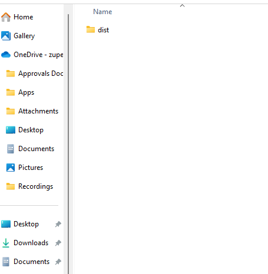

# Calendar?

Now you can choose the Preferred fields to display on the jobs calendar.

1. Select the “ **Jobs Schedule** ” module from the left pane.

2. Tap on the “ **Filter Schedule** ” icon.

3. Select the required fields to be visible on the job cards.

4. Tap “Apply Filters” to display the desired fields.

5. Now the images can be pasted.